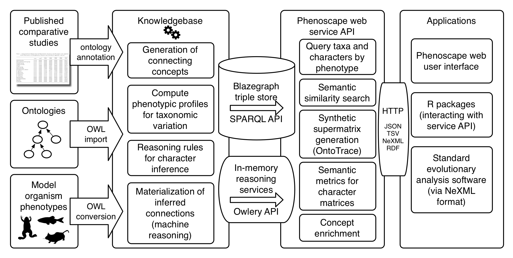

## AI for natural language trait observations

### Overview

We aim to create infrastructure that will provide comparative trait analysis tools easy access to algorithms powered by machines reasoning with and making inferences from the meaning of trait descriptions. Similar to how Google, IBM Watson, and others have enabled developers of smartphone apps to incorporate, with only a few lines of code, complex machine-learning and artificial intelligence capabilities such as sentiment analysis, we will demonstrate how easy access to knowledge computing opens up new opportunities for analysis, tools, and research. We will do this by addressing three long-standing limitations in comparative studies of trait evolution: recombining trait data, modeling trait evolution, and generating testable hypotheses for the drivers of trait adaptation.

### Motivation

The millions of species that inhabit our planet all have distinct biological traits that enable them to successfully compete in or adapt to their ecological niches. Determining accurately how these traits evolved is thus fundamental to understanding earth’s biodiversity, and to predicting how it might change in the future in response to changes in ecosystems. Although sophisticated analytical methods and tools exist for analyzing traits comparatively, applying their full power to the myriad of trait observations recorded in the form of natural language descriptions has been hindered by the difficulty of allowing these tools to understand even the most basic facts implied by an unstructured free-text statement made by a human observer.

The technological arsenal needed to overcome this challenge is now in principle available, thanks to a number of recent breakthroughs in the areas of knowledge representation and machine reasoning, but these technologies are challenging enough to deploy, orchestrate, and use that the barriers to effectively exploit them remains far too high for most tools.

### Research and development goals

We will create a centralized computational infrastructure that affords comparative analysis tools the ability to compute with morphological knowledge through scalable online application programming interfaces (APIs), enabling developers of comparative analysis tools, and therefore their users, to tap into machine reasoning-powered capabilities and data with machine-actionable semantics. By shifting all the heavy-lifting to this infrastructure, tools can programmatically obtain answers to knowledge-based questions that would otherwise require careful study by a human expert, such as objectively and reproducibly assessing the relatedness, independence, and distinctness of characters and character states, with only a few lines of code. To accomplish this, the project will adapt key products and know-how developed by the [Phenoscape] project, including an integrative knowledgebase of ontology-linked phenotype data (the [Phenoscape KB]), metrics for quantifying the semantic similarity of phenotype descriptions, and algorithms for synthesizing morphological data from published trait descriptions.

To drive development of the computational infrastructure and to demonstrate its enabling value, the project’s objectives focus on addressing three concrete long-standing needs for which the difficulty of computing with domain knowledge is the major impediment:

1. Computationally synthesizing, calibrating, and assessing morphological trait matrices from across studies;
2. Objectively and reproducibly incorporating morphological domain knowledge provided by ontologies into evolutionary models of trait evolution; and
3. Generating testable hypotheses for adaptive diversification by incorporating semantic phenotypes into ancestral state reconstruction and identifying domain ontology concepts linked to evolutionary changes in a branch or clade more frequently than expected by chance.

In addition, to better prepare evolutionary biologist users and developers of comparative analysis tools for adopting these new capabilities, a domain-tailored short-course on requisite knowledge representation and computational inference technologies will be developed and taught.

### Team

#### Principal Investigators
The team includes PIs and co-PIs at 4 institutions:

* Wasila Dahdul (University of South Dakota), leading data annotation, ontology development, and driving biological research questions;
* [Hilmar Lapp] (Duke University, [Center for Genomic and Computational Biology]), leading research and development of objective functions for character synthesis, client software (in particular R packages), and design of APIs;
* Todd Vision (University of North Carolina at Chapel Hill), leading research and development on semantic ancestral character reconstruction and phylogenetic character enrichment;
* Jim Balhoff (Renaissance Computing Institute), developing necessary software and reasoning infrastructure on top of the Phenoscape KB; 
* James Uyeda (Virginia Tech), leading research, development, and applications of computable knowledge-informed probabilistic models for trait evolution.

#### Join us

We are (or will soon be) actively recruiting undergraduate and graduate students as well as postdocs at different institutions:

- **Duke University / Hilmar Lapp** is recruiting a computational biology graduate student (3 years) or postdoc (2 years) for developing algorithms, objective functions, and statistics for calibration and cross-study synthesis of morphological trait matrices. See aim I and development goals Ia, Ib, and Ic in the [proposal text]. Beginning in Jan 2018, Lapp will also recruit semester-long undergraduate student interns to help with software development goals.

### Funding

This project has been funded by the US National Science Foundation (NSF) as collaborative awards [1661456] (Duke University), [1661529] (Virginia Tech), [1661516] (), and [1661356] within the Advances in Biological Informatics (ABI) program. The start date was Sep 1, 2017, and the award is for 3 years.

The grant proposal text with references is publicly available:
> W. Dahdul, J.P. Balhoff, H. Lapp, J. Uyeda, & T.J. Vision. (2017). Enabling machine-actionable semantics for comparative analyses of trait evolution. Zenodo. <http://doi.org/10.5281/zenodo.885538>

[Phenoscape]: http://phenoscape.org
[Phenoscape KB]: http://kb.phenoscape.org
[Hilmar Lapp]: http://lappland.io/
[Center for Genomic and Computational Biology]: http://genome.duke.edu/
[1661456]: https://nsf.gov/awardsearch/showAward?AWD_ID=1661456
[1661529]: https://nsf.gov/awardsearch/showAward?AWD_ID=1661529
[1661356]: https://nsf.gov/awardsearch/showAward?AWD_ID=1661356
[1661516]: https://nsf.gov/awardsearch/showAward?AWD_ID=1661516
[proposal text]: http://doi.org/10.5281/zenodo.885538
